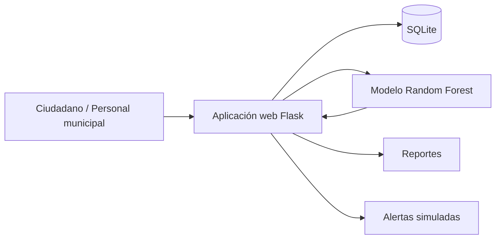

# Arquitectura propuesta

## Capas

1. **Interfaz web:** pantallas para registrar trámites, consultar expedientes y ver reportes.
2. **Lógica de negocio:** reglas para registrar, actualizar estados y calcular prioridades.
3. **Modelo de Machine Learning:** predice riesgo de retraso: Bajo, Medio o Alto.
4. **Base de datos:** almacena ciudadanos, trámites e historial.
5. **Reportes y alertas:** muestra indicadores y simula notificaciones al ciudadano.
