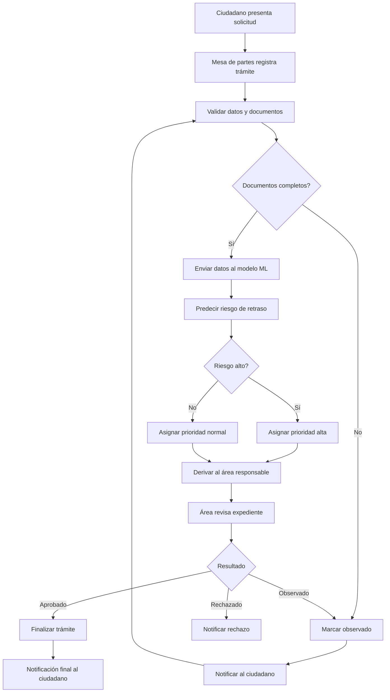

# Diagrama de flujo del trámite

```mermaid
flowchart TD
    A[Ciudadano presenta solicitud] --> B[Mesa de partes registra trámite]
    B --> C[Validar datos y documentos]
    C --> D{Documentos completos?}
    D -- No --> E[Marcar observado]
    E --> F[Notificar al ciudadano]
    F --> C
    D -- Sí --> G[Enviar datos al modelo ML]
    G --> H[Predecir riesgo de retraso]
    H --> I{Riesgo alto?}
    I -- Sí --> J[Asignar prioridad alta]
    I -- No --> K[Asignar prioridad normal]
    J --> L[Derivar al área responsable]
    K --> L
    L --> M[Área revisa expediente]
    M --> N{Resultado}
    N -- Aprobado --> O[Finalizar trámite]
    N -- Rechazado --> P[Notificar rechazo]
    N -- Observado --> E
    O --> Q[Notificación final al ciudadano]
```
